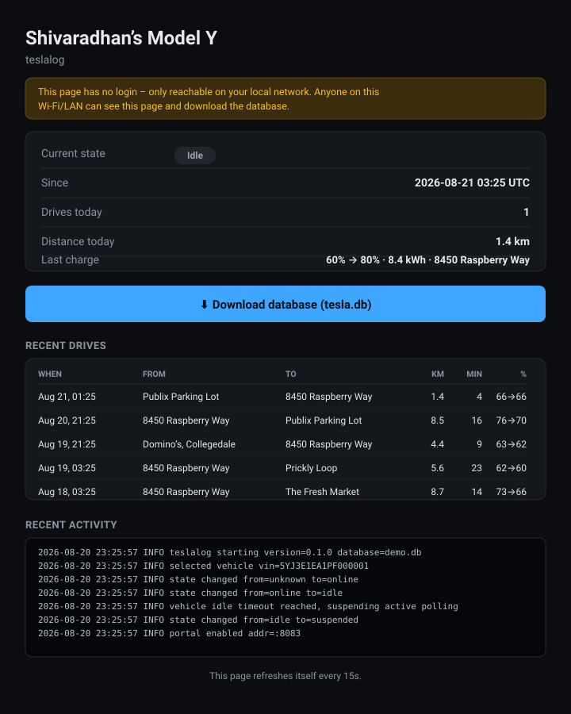

# TeslaLog Mini

[](https://goreportcard.com/report/github.com/shivardev/tessieWatcher)
[](LICENSE)
[](go.mod)
[](#building)
[](#building)

**TeslaMate's data model, TeslaMate's sleep-aware polling, TeslaMate's
field-for-field SQLite schema — in one static Go binary with no Postgres,
no Grafana, no Docker, no Elixir runtime.** Built to run comfortably on a
Raspberry Pi Zero 2 W's 512MB of RAM, and to keep working when Tesla's
unofficial API shifts under it (which it does, regularly — see
[Authentication](#authentication)).

## Why this exists

TeslaMate is a genuinely excellent piece of software, and this project
isn't trying to replace it for anyone it already works well for. It exists
for one narrow, specific reason: TeslaMate's stack — Postgres, Grafana, a
Phoenix/Elixir runtime, MQTT — is real infrastructure, and a Pi Zero 2 W
doesn't have room for it. teslalog is what's left when you ask "what does
the *logging* actually need to be?" and answer honestly: an OAuth client,
a sleep-aware state machine, and a place to put the rows. Everything else
— dashboards, address lookup, cost modeling — can be layered on top of a
correct SQLite file by whatever tool you already trust, including
TeslaMate's own Grafana dashboards, pointed at this data instead.

The one behavior this project cares about getting *right*, more than any
feature: **while the car is asleep, leave it alone.** See
[Sleep behavior](#sleep-behavior) below — a badly written Tesla logger
that polls `vehicle_data` on a fixed interval forever will keep the car
awake and cause real phantom-drain battery loss. Every other design
decision in this codebase is secondary to that one.

## What it looks like

teslalog ships a small, dark-themed, read-only web page (on by default,
no login — see [Portal](#portal-optional-web-page--database-download)):
current vehicle state, today's drives, recent drives with resolved
locations, the last charge, a live tail of what the daemon is doing, and
a one-click database download.

<p align="center">
  
</p>

<sub>This is a preview generated from the actual page template and
sample data, not a live screenshot — see the real thing at
`http://<your-pi>:8083` once it's running.</sub>

```
Tesla
  │
  ├── Owner API (unofficial, same one TeslaMate uses today)
  └── Tesla streaming websocket (legacy, supplemental GPS/telemetry)
          │
          ▼
Raspberry Pi Zero 2 W
┌───────────────────────────────┐
│ teslalog (one Go binary)       │
│  auth (PKCE/SSO) + refresh     │
│  Owner API client              │
│  streaming client              │
│  vehicle state machine         │
│  geofencing / reverse-geocode  │
│  SQLite storage (WAL)          │
│  read-only web portal          │
└──────────────┬─────────────────┘
               ▼
     /var/lib/teslalog/tesla.db
```

## What it deliberately does NOT do

This is a **read-only historian**. It does not send commands to the car
(no remote climate/charge control), and it doesn't bundle a full
dashboarding stack — just a SQLite file you can query, export to CSV,
view in the built-in portal, or point Grafana/Metabase/anything else at.

## Repository layout

```
cmd/teslalog/          CLI entrypoint (auth, run, status, wake, backup, export)
internal/config/       TOML config loading (config.example.toml)
internal/tesla/        Owner API + SSO auth + streaming client (isolated on purpose)
internal/vehicle/      sleep-aware state machine (pure, unit-tested, no I/O)
internal/storage/      SQLite schema + queries (ncruces/go-sqlite3, pure Go, no cgo)
internal/backup/       online SQLite backup (safe under WAL) + gzip + rotation
internal/portal/       optional read-only HTTP page + database download (see Portal below)
internal/runner/       wires the above into the daemon loop `teslalog run` executes
systemd/teslalog.service
deploy/cross-build.sh  cross-compile for the Pi (linux/arm64)
deploy/install.sh       installs the binary + systemd unit + config on the Pi
Dockerfile, docker-compose.yml   optional container deployment (see below)
```

If Tesla ever kills the Owner API, only `internal/tesla/` needs replacing
(e.g. with a Fleet API client) — the schema, state machine, backups and CLI
are untouched.

## Sleep behavior

The state machine (`internal/vehicle/state_machine.go`) enforces one rule
mechanically:

```
ASLEEP / OFFLINE    ->  only the cheap GET /api/1/vehicles check
                        (never wakes the car), every asleep_interval
                        (default 30s, matches TeslaMate's own
                        @asleep_interval - verified directly against
                        its source, applies identically to both states)

SUSPENDED           ->  same cheap check, but every suspended_check_interval
                        (default 21m, matches TeslaMate's own
                        car_settings.suspend_min)

DRIVING              ->  full vehicle_data poll every driving_interval
                        (default 2.5s, matches TeslaMate's own default)

CHARGING             ->  full vehicle_data poll every charging_interval
                        (default 5s, matches TeslaMate's own default)

UPDATING             ->  full vehicle_data poll every online_interval,
                        and deliberately NEVER idle-suspends: a 20+
                        minute install is normal, i.e. longer than
                        idle_timeout, and the cheap check can't see an
                        install finish. Matches TeslaMate's own
                        {:updating, _} state.

ONLINE / IDLE        ->  full vehicle_data poll every online_interval
                        (default 15s, matches TeslaMate's own default)

IDLE for >= idle_timeout (default 15m, matches TeslaMate's own
                        car_settings.suspend_after_idle_min)  ->
                        transition to SUSPENDED, stop calling
                        vehicle_data, let the car sleep

Vehicle goes unreachable mid-DRIVE or mid-CHARGE (see
                        vehicle.Machine.OnUnreachable) -> ASLEEP
                        abandons immediately; OFFLINE while driving
                        waits out drive_timeout (default 15m, matches
                        TeslaMate's own @drive_timeout_min) measured
                        from the last real observation, not "now";
                        OFFLINE while charging is never auto-abandoned
                        (matches TeslaMate - it just keeps checking).
                        An abandoned drive/charge is closed using its
                        last known recorded sample rather than left
                        open forever.
```

`wake_up` is called from exactly one place in the whole codebase: the
manual `teslalog wake` CLI command. The daemon loop (`internal/runner`)
never calls it.

```
              ASLEEP / OFFLINE
                       │ becomes active (seen via cheap check)
                       ▼
                    ONLINE
              /    /    |     \
             ▼    ▼     ▼      ▼
     UPDATING DRIVING CHARGING IDLE
          │      │       │        │ idle_timeout elapsed (15m default)
          │      │       │        ▼
          │      │       │    SUSPENDED
          └──────┴───────┴────────┘
                       │
                       ▼
              ASLEEP / OFFLINE (confirmed by next cheap check,
                                every 30s default)
```

Coming back from `ASLEEP`/`OFFLINE` also reconciles what happened during
the gap: if the vehicle gained more than 5 km of ideal range while
unobservable (over at least 5 minutes), it must have been charging
somewhere, so a complete charging session is synthesized from the
before/after readings rather than that energy silently vanishing — and
rather than it showing up as an impossible battery *gain* in vampire
drain analysis. Matches TeslaMate's own inference and thresholds.

(`ASLEEP` vs `OFFLINE` mirrors the Owner API's own vehicle summary state
exactly — "asleep" is a normal sleep, "offline" means the car hasn't
phoned home at all; both stop active polling identically.)

The portal's "Asleep (last 24h)" stat is this policy's actual receipt,
not just a description of it — `internal/storage`'s `states` table
already records every transition, so the percentage of the last 24
hours spent in `asleep`/`offline`/`suspended` is one query away
(`Store.SleepStats24h`). A car that mostly sits in a garage overnight
should show a high number here; if it doesn't, that's a real signal
something (sentry mode, a stuck climate/charge setting, a background
app periodically opening the mobile app) is keeping it awake.

## Data model & TeslaMate parity

SQLite tables: `vehicles`, `states` (state-machine history), `drives` +
`positions`, `charging_sessions` + `charging_samples`, `battery_samples`,
`software_updates`. Full schema in `internal/storage/schema.go`. All
distances/speeds/temperatures are stored in metric units even though the
Owner API itself reports miles/Fahrenheit-adjacent fields.

This schema was built by reading TeslaMate's actual Ecto schema files
(`lib/teslamate/log/{car,position,drive,charging_process,charge,state,
update}.ex`) field-by-field, not from memory, so the parity claim here is
checked against TeslaMate's real source rather than approximate. Per table:

- **positions** (per-drive GPS/telemetry samples): matches TeslaMate's
  `positions` field-for-field — rated/ideal/estimated range as three
  separate figures, raw vs. usable battery %, full climate state (inside/
  outside temp, fan status, driver/passenger temp settings, defrosters,
  climate on/off), all four TPMS tire pressures, and all three battery
  heater signals (`battery_heater_on` from `charge_state`, plus
  `battery_heater`/`battery_heater_no_power` from `climate_state` —
  genuinely different signals that disagree in real data, e.g. the pack
  conditioning itself while not actively charging).
  teslalog additionally keeps `shift_state` and `heading` per position,
  which TeslaMate derives/stores differently.
- **drives**: start/end odometer, distance, duration, battery %, rated
  *and* ideal range, max speed, max/min power, avg outside/inside temp,
  and ascent/descent (computed from position elevation deltas, same as
  TeslaMate's 2025 addition) — all present. TeslaMate normalizes battery
  level via a joined `position_id` rather than storing it directly on
  `drives`; teslalog denormalizes it onto the row itself for a simpler
  single-file schema, with no data loss (the full position history is
  still there).
- **charging_sessions / charging_samples**: matches TeslaMate's
  `charging_processes`/`charges` field-for-field — usable battery %,
  charger phases/pilot current/cable type, fast-charger brand & type,
  rated *and* ideal range, battery heater / "not enough power to heat"
  flags, avg outside temp. Two figures the Owner API doesn't report
  directly (TeslaMate doesn't get them from the API either — it *models*
  them) are computed the same way TeslaMate computes them:
  `charge_energy_used_kwh`, integrated from measured charger power over
  the session's samples (with a configurable efficiency factor only as a
  fallback when no usable power readings exist), and `cost`, from
  per-geofence pricing including per-kWh or per-minute billing, flat
  session fees, and free supercharging — see
  [Charging prices per location](#charging-prices-per-location).
  `is_dc_fast_charge` is
  derived at close time from whether any sample in the session ever saw
  `fast_charger_present` — the AC/DC "type" split TeslaMate's own
  Charging Stats dashboard shows, computed here instead of stored raw by
  the API.
- **states**: TeslaMate's own `states` table only tracks
  online/offline/asleep; teslalog's is a superset, additionally
  recording driving/charging/idle/suspended (TeslaMate keeps that finer
  state only in memory).
- **vehicles**: VIN, exterior color, wheel type, spoiler type straight
  from the API, plus `model`/`trim_badging`/`marketing_name`. Those
  three are **not** raw API fields even in TeslaMate — the Owner API
  only reports `car_type`/`trim_badging` codes (e.g. `"model3"`,
  `"74D"`); TeslaMate derives the normalized model letter (`"3"`) and
  human trim name (`"LR AWD"`) via a hardcoded lookup table
  (`Vehicle.identify/1`, including a VIN-model-year check to
  disambiguate the Model 3 base trim). `internal/tesla/identity.go`
  ports that exact table (unit-tested against the same cases), so this
  is genuinely the same derived value, not just the same raw string.
  Also carries the optional user-supplied `efficiency_wh_km`
  (config-only, like TeslaMate's — not derived, just stored for
  whatever reads the DB to use), and `firmware_version` — the car's
  currently-installed software (`vehicle_state.car_version`), kept
  fresh on every idle poll. TeslaMate only ever records this
  transiently (as a row in its own `software_updates`-equivalent
  table mid-update); teslalog also keeps the latest one directly on
  the vehicle row for a cheap "what's it currently running" read.
- **software_updates**: start/end/version, same as TeslaMate.

**Polling cadence**: `driving_interval`/`charging_interval`/
`online_interval` (2.5s/5s/15s) match TeslaMate's own published
defaults (`Vehicle.driving_interval`/`charging_interval`/
`default_interval`), so drive tracks in particular have comparable
position density instead of one flat 30s rate. Deliberately **not**
reproduced: TeslaMate additionally backs its REST poll rate off further
while its streaming connection is actively delivering telemetry,
adaptively tightens/loosens the charging interval via a sample-count
formula, and applies exponential backoff on repeated fetch errors. That
full scheduler is intricate, undocumented outside its source, and tuned
for TeslaMate's own streaming/REST arbitration; teslalog's own streaming
client already supplements REST-derived positions the same way TeslaMate's
does, but the REST cadence itself is a fixed, configurable interval per
state rather than that adaptive state machine.

**Geofencing & locations**: `drives.start_location`/`end_location` and
`charging_sessions.location` resolve to human-readable place names — see
[Geofencing & locations](#geofencing--locations) below for how. Raw
`start_lat`/`start_lng` etc. are always still stored regardless, so
nothing is lost if a location never resolves to a name.

**Derived stats (computed at read time, not stored as columns)**:
`teslalog export drives`/the portal's Recent drives table show a
rated-range-km-lost-per-km-driven ratio (≈1.0 means the drive matched
its EPA/WLTP rating; higher means it drove less efficiently than
rated) — the same figure `grafana/teslalog-efficiency.json` charts over
time. `teslalog export charges`/the portal's Recent charges table show
kWh added per rated-range-km gained, a rough charging-efficiency figure
(higher usually means a colder battery or a lossier charger). Both are
plain arithmetic over columns that are already stored, computed fresh
on every read — see `DriveSummary.EfficiencyRatio`/
`ChargeSummary.KwhPerRatedKm` in `internal/storage/storage.go`.

**Still not ported**: TeslaMate's per-geofence charge pricing (different
`price_per_kwh` depending on which named zone a charge happened in).
teslalog's `charging_sessions.cost` is one flat rate for the whole
account (`config.toml`'s `[charging].price_per_kwh`) — a real, deliberate
simplification, not a gap that's cheap to close the way geofencing
itself was.

## Building

### Local build (for development/testing on your own machine)

```sh
go build ./...
go test ./...
```

Storage uses `ncruces/go-sqlite3` — SQLite compiled to WebAssembly and
embedded in the Go module, run via the pure-Go `wazero` runtime — so
there's no cgo and no C compiler needed at all, on any platform.

### Cross-compile for x86_64 and the Pi Zero 2 W (arm64)

On your dev machine, no cross-toolchain required for either target
(no cgo anywhere in this project — see above):

```sh
bash deploy/cross-build.sh
# produces:
#   teslalog-linux-amd64      - regular PC/server/VM, e.g. wherever your
#                               existing TeslaMate/Docker host runs, for
#                               testing side-by-side before touching the Pi
#   teslalog-linux-arm64      - the Raspberry Pi Zero 2 W (actual target)
#   teslalog-windows-amd64.exe - for run-teslalog.bat/status-teslalog.bat,
#                               to try it directly on a Windows dev machine
```

Either Linux binary is a single static file — no install step, no
Docker, no systemd required just to run it. Copy it anywhere and:

```sh
cp config.example.toml config.toml   # edit database/token_file paths as you like
./teslalog-linux-amd64 auth   -config config.toml   # one-time interactive login
./teslalog-linux-amd64 run    -config config.toml   # foreground; Ctrl-C to stop
./teslalog-linux-amd64 status -config config.toml
```

### Trying it directly on Windows

No Linux box, Pi, or Docker needed just to see it work: after
`bash deploy/cross-build.sh` produces `teslalog-windows-amd64.exe`, put it
at the repo root (`config.windows-test.toml` is already there, with
relative `database`/`token_file` paths so nothing needs admin rights) and
double-click, or run from a terminal:

```
run-teslalog.bat      # first run: prompts for the one-time Tesla login,
                       # then starts the daemon in the foreground
status-teslalog.bat    # today's drives/last charge, and exports
                       # drives.csv/charges.csv next to the .bat files
```

This is the same daemon and database format as the Linux/Pi path — useful
for a quick first look, or for side-by-side testing against an existing
TeslaMate instance (see below) without leaving your desk. For the real
unattended deployment, follow [Deploying to the Pi](#deploying-to-the-pi)
or [Running with Docker](#running-with-docker) instead.

## Deploying to the Pi

### The fast way: one command, no clone, no cross-build

Flash 64-bit Raspberry Pi OS Lite (or 32-bit — the installer detects
which), enable SSH + Wi-Fi, boot it, `ssh` in, then run:

```sh
curl -fsSL https://raw.githubusercontent.com/shivardev/tessieWatcher/master/deploy/quick-install.sh | sudo bash
```

This downloads the right prebuilt binary for your Pi's exact CPU
(detected via `uname -m` — `aarch64` → `teslalog-linux-arm64`,
`armv7l` → `teslalog-linux-armv7`) straight from this repo's [latest
release](https://github.com/shivardev/tessieWatcher/releases/latest),
along with `config.example.toml` and the systemd unit, and runs the
same install steps as `deploy/install.sh` (below) with them — nothing
it does is hidden; read `deploy/quick-install.sh` if you want to see
every step first. No `git clone`, no dev machine, no cross-compiling
required.

Then:

1. Authenticate: `sudo -u teslalog teslalog auth -config /etc/teslalog/config.toml`
   - This prints a Tesla login URL. Open it **on any device with a
     browser** (doesn't have to be the Pi), log in, and paste back the
     resulting `auth.tesla.com/void/callback?code=...` URL. Tesla's login
     can require 2FA/CAPTCHA, which is why this can't be fully
     automated — see [Authentication](#authentication).
2. `sudo systemctl enable --now teslalog`
3. `journalctl -u teslalog -f` to watch it discover your vehicle and
   start logging.

### The manual way: cross-build on your own machine

If you'd rather build from source yourself (e.g. you've changed the
code) instead of using a prebuilt release binary:

1. Cross-build (see [Building](#building)) and check the Pi's arch as
   above.
2. `scp -r teslalog-linux-arm64 deploy/ systemd/ config.example.toml pi@<host>:~/teslalog/`
   (the `-r` matters — `deploy/` and `systemd/` are directories; without
   it, scp refuses them.)
3. On the Pi: `cd ~/teslalog && sudo bash deploy/install.sh teslalog-linux-arm64`
4. Same authenticate/enable/watch-logs steps as above.

## Running with Docker

Optional — the systemd path above needs no Docker at all. If you'd rather
run it as a container (on the Pi or anywhere else):

```sh
docker compose build
docker compose run --rm teslalog auth      # one-time interactive login (see Authentication below)
docker compose up -d
docker compose logs -f
```

Everything (`tesla.db`, `tokens.json`, backups) lives in the
`teslalog-data` named volume, and `config.toml` lives in a separate
`teslalog-config` volume (seeded from `config.example.toml` on first run),
so both your data and any config edits (VIN, intervals, charging cost)
survive container recreation and image rebuilds. Run any other
subcommand the same way, e.g. `docker compose run --rm teslalog status` or
`docker compose run --rm teslalog export drives -out /var/lib/teslalog/drives.csv`
(then `docker cp` or `docker compose cp` the file out of the volume).

Building directly for the Pi's arm64 from another machine:
`docker buildx build --platform linux/arm64 -t teslalog:arm64 --load .`,
then `docker save`/`docker load` it onto the Pi, or just build it on the
Pi itself (the image is small and the build has no cgo/cross-toolchain
requirement either).

The image is `gcr.io/distroless/static-debian12:nonroot` on top of the
same static, cgo-free binary the systemd path uses — no shell, no package
manager, just the binary and CA certificates for HTTPS to Tesla, running
as an unprivileged uid (matching the non-root posture of
`systemd/teslalog.service` on the bare-metal path).

## Authentication

Tesla retired the old username/password OAuth grant years ago. Like
TeslaMate, teslapy, and other current tools, `teslalog auth` uses the same
SSO PKCE login flow as the official Tesla mobile app:

1. Generates a PKCE code verifier/challenge pair.
2. Prints a `https://auth.tesla.com/oauth2/v3/authorize?...` URL.
3. You log in in a browser. Tesla redirects to
   `tesla://auth/callback?code=...&state=...` — the same custom URL
   scheme the official Tesla app registers itself to handle. Since
   nothing else on a normal machine is registered for it, most browsers
   just hang on a "Loading..." screen forever with nothing visible to
   copy (some show an "Open Tesla?"/"can't open this link" prompt
   instead — behavior varies).
   (Until ~April 2026 this redirected to a dead `void/callback` *https*
   page instead, which every third-party tool — TeslaMate, teslapy,
   tesla_auth, and this project — could just read from the address bar.
   Tesla tightened redirect_uri validation and broke that trick
   account-wide; `tesla://auth/callback` is the fix the wider
   TeslaMate/tesla_auth ecosystem converged on, see
   [teslamate-org/teslamate#5296](https://github.com/teslamate-org/teslamate/issues/5296).)

   Two ways to get the code out of that redirect:
   - **Automatic (recommended, same machine only):** once, run
     `.\deploy\register-tesla-protocol.ps1 -TeslalogPath .\teslalog-windows-amd64.exe`
     (no admin rights needed — it's a per-user registration). From then
     on, Windows hands the `tesla://` redirect straight to
     `teslalog auth-callback`, which relays it to your waiting
     `teslalog auth` automatically — nothing to copy/paste at all. Remove
     it later with `-Unregister`. (Linux/Pi equivalent: register a
     `.desktop` file as the `x-scheme-handler/tesla` handler via
     `xdg-mime` yourself — not scripted here, since the Pi's daemon
     doesn't run a browser at all; do the login step from your own
     desktop instead.)
   - **Manual (works from any device, e.g. logging in from your phone):**
     get the full `tesla://auth/callback?code=...&state=...` URL however
     your browser exposes it — some show it in the failure dialog/page's
     text; if not, open DevTools (F12) *before* clicking login and check
     the Network or Console tab afterwards for the blocked navigation,
     which carries the full URL — and paste it (or just the `code`
     value) into the waiting `teslalog auth` prompt.
4. `teslalog auth` exchanges that code for an access + refresh token pair,
   saved to `/var/lib/teslalog/tokens.json` (mode 0600 — a real
   permission restriction on Linux; on Windows, e.g. via
   `run-teslalog.bat`, the file gets default OS permissions instead, since
   Windows doesn't have a POSIX mode bit for Go's `os.WriteFile` to set).
5. The daemon refreshes the access token automatically using the refresh
   token; if the refresh token itself ever expires/is revoked (e.g. Tesla
   password changed), re-run `teslalog auth`.

Your Tesla password is never stored — only these OAuth tokens.

**Caveat:** the Owner API is unofficial. Tesla could restrict or remove it.
That's precisely why `internal/tesla/` is isolated from everything else —
swapping to a different Tesla API surface later doesn't touch your
database, drive detection, or backups.

### Troubleshooting: `HTTP 403 forbidden, see fleet-api docs`

If `journalctl -u teslalog` shows `select vehicle: list vehicles: HTTP 403:
{"response":null,"error":"forbidden, see https://developer.tesla.com/docs/fleet-api"...}`,
this is **not** teslalog calling the Fleet API (it never does — always
`owner-api.teslamotors.com` with `client_id=ownerapi`, same as TeslaMate),
and it's usually not your token being simply expired either — you can
confirm which by curling both a trivial endpoint and the failing one with
your own token straight from `/var/lib/teslalog/tokens.json`:

```sh
TOKEN=$(sudo grep -o '"access_token": *"[^"]*"' /var/lib/teslalog/tokens.json | cut -d'"' -f4)
curl -s -w "\nHTTP %{http_code}\n" -H "Authorization: Bearer $TOKEN" https://owner-api.teslamotors.com/api/1/users/me
curl -s -w "\nHTTP %{http_code}\n" -H "Authorization: Bearer $TOKEN" https://owner-api.teslamotors.com/api/1/products
```

If **both** fail with the identical error (even via plain `curl`, not just
teslalog), it's Tesla's edge fingerprinting the TLS handshake used to
*mint or refresh* the token, and rejecting every later call made with a
token minted that way — regardless of what makes the later call. TeslaMate
hit and fixed this exact symptom in June 2026
([teslamate-org/teslamate#5399](https://github.com/teslamate-org/teslamate/issues/5399),
fixed by [#5406](https://github.com/teslamate-org/teslamate/pull/5406):
forcing HTTP/2 + TLS 1.3 for the token-minting client); a Home Assistant
integration maintainer described the mechanism directly in
[alandtse/tesla#1200](https://github.com/alandtse/tesla/pull/1200): *"the
403 is not the API dying and not the token being invalid, it is Tesla
refusing the client that minted it."* `internal/tesla/httpclient.go`'s
`NewHardenedClient` (used for every Tesla API call and token
exchange/refresh, v0.2.2+) forces TLS 1.3 for exactly this reason. If
you're already on v0.2.2+ and still hit this:

1. `sudo teslalog update -config /etc/teslalog/config.toml` to make sure
   you're on the latest (Tesla has adjusted this fingerprint check more
   than once — see the GitHub issues above for the ongoing pattern).
2. Re-run `teslalog auth` for a completely fresh token pair minted through
   the fixed client — a token already flagged by the old client's
   fingerprint may not "heal" itself via refresh alone.
3. If it's still happening after both, it may be a genuinely new
   fingerprint requirement beyond TLS version/ALPN (cipher suite order,
   extensions, etc.) — check for a newer TeslaMate/alandtse-tesla fix
   first, since they hit these before we would.

## Configuration

See `config.example.toml` for every field with inline docs. Key ones:

| Field | Default | Meaning |
|---|---|---|
| `polling.driving_interval` | `2.5s` | `vehicle_data` poll rate while driving (matches TeslaMate's default) |
| `polling.charging_interval` | `5s` | `vehicle_data` poll rate while charging (matches TeslaMate's default) |
| `polling.online_interval` | `15s` | `vehicle_data` poll rate while online-idle (matches TeslaMate's default) |
| `polling.idle_timeout` | `15m` | how long idle-online before we suspend polling (matches TeslaMate's `suspend_after_idle_min`) |
| `polling.suspended_check_interval` | `21m` | how often we check "is it awake yet" once suspended (matches TeslaMate's `suspend_min`) |
| `polling.asleep_interval` | `30s` | how often we check "is it awake yet" while asleep/offline (matches TeslaMate's `@asleep_interval`) |
| `polling.drive_timeout` | `15m` | how long a drive can go OFFLINE before it's abandoned/closed (matches TeslaMate's `@drive_timeout_min`) |
| `backup.retention_days` | `30` | days of nightly backups to keep |
| `vehicle.efficiency_wh_km` | `0` (off) | starting estimate only — teslalog derives the real figure from your own charging history and overwrites it, as TeslaMate does |
| `charging.efficiency` | `0` (off) | fallback only — energy used is normally integrated from measured charger power; this covers sessions with no usable power readings |
| `charging.price_per_kwh` | `0` (off) | fallback rate for charges outside every priced geofence — per-location prices live on the geofences themselves, see [Charging prices per location](#charging-prices-per-location) |
| `charging.free_supercharging` | `false` | any Tesla-branded fast charge costs 0, overriding all other pricing |
| `geofence.cost_per_unit` | (unset) | per-location charging price; `0` means free, unset means cost unknown |
| `geofence.billing_type` | `per_kwh` | or `per_minute` |
| `geofence.session_fee` | `0` | flat amount added once per charging session |
| `polling.offline_charge_min_gap` | (see config) | minimum unobserved gap before a range increase is recorded as a charge that happened while teslalog couldn't see it |

## CLI reference

```
teslalog auth                        interactive Tesla login
teslalog run                         run the daemon (systemd runs this)
teslalog status                      today's drives/distance + last charge
teslalog wake                        explicit manual wake (never automatic)
teslalog backup                      run one backup immediately
teslalog export drives  [-year 2026] [-out drives.csv]
teslalog export charges [-year 2026] [-out charges.csv]
teslalog update                       self-update to the latest GitHub release
```

(`teslalog auth-callback <url>` also exists, but isn't meant to be run by
hand — see [Authentication](#authentication)'s `register-tesla-protocol.ps1`
step; Windows invokes it for you.)

## Updating

No `git clone`, no rebuilding from source, no re-authenticating:

```sh
sudo systemctl stop teslalog          # optional but recommended: avoids
                                       # replacing the binary while it's
                                       # actively running
sudo teslalog update -config /etc/teslalog/config.toml
sudo systemctl start teslalog
```

Run this as **root**, not as the unprivileged `teslalog` service user —
unlike `auth` (which must run as `teslalog`, so the resulting
`tokens.json` is owned by the same user the daemon runs as), `update`
replaces the binary at `/usr/local/bin/teslalog`, a root-owned system
path (see `deploy/install.sh`); `teslalog` itself has no write access
there by design, the same way it can't write anywhere else outside
`/var/lib/teslalog`. Running it as the service user fails with a
permission error (which `teslalog update` recognizes and tells you to
re-run as root instead, rather than leaving you to guess).

`teslalog update` checks this project's
[GitHub Releases](https://github.com/shivardev/tessieWatcher/releases)
for a newer version, downloads the binary matching whatever platform
it's currently running on, and replaces itself in place — same binary
path, same `tokens.json`, same `tesla.db`, nothing else touched. Skipping
the stop/start bracket above still works on Linux (replacing a running
executable's file is safe there — the currently-running process keeps
using the old file until it restarts), it's just not possible on Windows
(the OS locks a running `.exe`); `teslalog update` detects that case and
tells you what to do instead.

First-time install: see [Deploying to the Pi](#deploying-to-the-pi) —
either the `curl | bash` one-liner or the manual cross-build path.
`update` is for every install after that.

## Backups

`internal/backup` uses SQLite's *online backup API* (not a raw file
copy), so it's safe to run against the live database while the daemon is
writing to it under WAL. Backups are gzipped and written to
`/var/lib/teslalog/backups/teslalog-YYYY-MM-DD.db.gz`, pruned after
`retention_days`. The daemon runs this automatically every
`backup.interval` (default 24h); `teslalog backup` runs one on demand.
Consider periodically copying that directory off the Pi's SD card
(rsync/rclone to another machine or cloud storage) — this project
doesn't do off-box replication itself.

The resulting snapshot/backup file is explicitly switched to
non-WAL (`PRAGMA journal_mode = DELETE`) after the copy — it's a static,
one-shot file nothing writes to again, and leaving it flagged WAL (with
no matching `-wal`/`-shm` sidecar files, which don't survive being
copied/downloaded elsewhere) forces every reader through a WAL-recovery
step on open; concurrent readers of the same file (e.g. Grafana loading
several dashboard panels against a downloaded copy at once — a real bug
found live, before v0.2.3) race for that recovery and the loser gets
`SQLITE_BUSY_RECOVERY` ("database is locked"), even though nothing is
actually writing to the file.

## Portal (optional web page + database download)

Set `[portal] enabled = true` (the default) in config.toml and teslalog
serves a tiny read-only dark-mode page at `addr` (default `:8083`, e.g.
`http://<pi-hostname-or-ip>:8083`): current battery %/rated range,
installed firmware version, today's and lifetime drive/charge totals
(odometer included), the last five drives and charges (with the AC/DC
type and derived efficiency figures from
[Data model & TeslaMate parity](#data-model--teslamate-parity) above),
a live tail of recent log activity, and a "Download database" button.
That button takes a fresh, consistent snapshot of the live database
(same safe online-backup mechanism as scheduled backups, just
uncompressed and on demand) and downloads it as `tesla-YYYY-MM-DD.db`.

**There is no login.** This is meant for your own home network only —
open that address from your phone/laptop while on the same Wi-Fi as the
Pi. Do not port-forward this address to the public internet; the
database is a complete log of everywhere the vehicle has been and when.

### JSON endpoints

Alongside the page and the download button, the portal serves two small
JSON endpoints, meant for a frontend or a script that wants live status
without re-downloading and re-parsing the whole database each time:

| Endpoint | Returns |
|---|---|
| `GET /api/status` | current state, battery %, rated/ideal range, odometer, firmware, the running teslalog version, and the active drive/charge id if one is in progress |
| `GET /api/meta` | `{"last_updated", "size_bytes"}` for the live database file, so a caller can tell whether re-downloading is even worth it |

Fields that aren't known are omitted rather than sent as null, so check
for the key rather than assuming it's present.

Confirming an update actually landed is one request:

```bash
curl -s http://<pi>:8083/api/status | grep -o '"version":"[^"]*"'
```

Every route (including `/` and `/download`) sends a permissive CORS
header, so a frontend served from a different origin or port can fetch
them directly. Note that a page served over **HTTPS** cannot fetch these
plain-HTTP endpoints — browsers block that as mixed content — so a
browser frontend that polls them has to be served over HTTP on the same
network, not from an HTTPS host.

### Viewing the data in Grafana

The daemon itself still doesn't bundle or run Grafana (see
[What it deliberately does NOT do](#what-it-deliberately-does-not-do)) —
but [`grafana/`](grafana/) has a self-contained, optional `docker-compose.yml`
that gets you a fully-provisioned Grafana (plugin, datasource, and all 7
dashboards below, already wired up, zero manual clicking) on whatever
other machine you actually want to look at dashboards from:

```sh
cd grafana
./refresh-data.sh http://<your-pi-ip>:8083    # pulls tesla.db from your own portal
docker compose up -d
```

Then open `http://localhost:3001`. See [`grafana/README.md`](grafana/README.md)
for the details (changing the default login, running it on a different
machine, keeping data fresh, running it alongside an existing Grafana).

**If you'd rather add this to an existing Grafana instance instead:**

1. Install the community **SQLite datasource plugin**
   (`frser-sqlite-datasource`) on your Grafana instance:
   `grafana-cli plugins install frser-sqlite-datasource`, then restart
   Grafana with `GF_PLUGINS_ALLOW_LOADING_UNSIGNED_PLUGINS=frser-sqlite-datasource`
   set (Grafana blocks unsigned community plugins from loading without it,
   even after the files are installed).
2. Add a data source of that type, pointing its "Path" setting at the
   downloaded `tesla-YYYY-MM-DD.db` file (or, for something that stays
   current, a path you periodically re-download to — this plugin reads
   the file directly, it doesn't poll teslalog itself).
3. Import one of the ready-made dashboards in [`grafana/`](grafana/) —
   Drives, Charges, Drive Stats, Mileage, States, Battery, and Efficiency,
   built against teslalog's actual schema — or build your own panels with
   plain SQL (see [Data model & TeslaMate parity](#data-model--teslamate-parity)
   above for the exact tables/columns), e.g.:
   `SELECT start_time, distance_km, duration_min, start_battery_level, end_battery_level, max_speed_kmh FROM drives WHERE status = 'closed' ORDER BY start_time DESC`.

**If you already have TeslaMate's Grafana dashboards**: they won't work
unmodified against this file. TeslaMate's dashboards query a Postgres
database with different table/column names than teslalog's SQLite
schema (even though the underlying data is equivalent — see the parity
table above for the exact mapping) — that's exactly what the dashboards
in [`grafana/`](grafana/) are: the same panels, rewritten against
teslalog's schema.

## Geofencing & locations

`drives.start_location`/`end_location` and `charging_sessions.location`
resolve GPS coordinates to human-readable place names, the same job
TeslaMate's `geofences`/`locations` tables do — teslalog's own simpler
take on it, in `internal/geocode`. Two layers, cheapest first:

1. **Named zones** — `[[geofence]]` entries in config.toml (name + lat +
   lng + radius_m). Matching against a short list is pure math, no
   network call at all. This is how a repeated spot like home shows up
   with a real name for free.
2. **Reverse-geocoding** (opt-in, off by default) — for anywhere you
   haven't named, `[geocoding] enabled = true` falls back to an HTTP
   lookup against an OSM Nominatim-compatible service, cached in
   `geocode_cache` so the same spot is never looked up twice. Off by
   default because, unlike geofences, this sends that location's
   coordinates to a third-party server — turn it on deliberately, not
   by accident. See `config.example.toml`'s `[geocoding]` section for
   the exact tradeoffs and Nominatim's usage policy.

Raw `start_lat`/`start_lng` (etc.) are always stored regardless of
whether either layer resolves a name, so nothing is ever lost — a
location just shows up as coordinates instead of a name until you add a
geofence for it or turn geocoding on.

### Charging prices per location

A geofence can also carry its own charging price, which is how
per-location rates are expressed: electricity costs differ between
home, a paid apartment charger, and a free one at a store, so a single
global rate can't be right for all of them. A geofence's price always
takes precedence over `[charging].price_per_kwh`, which is only the
fallback for charges outside every priced zone.

```toml
[[geofence]]
name          = "Home"
lat           = 35.108234
lng           = -85.063226
radius_m      = 50
cost_per_unit = 0.125

[[geofence]]
name          = "Apartment charger"
lat           = 36.122018
lng           = -86.774588
radius_m      = 50
cost_per_unit = 0.30
session_fee   = 0.45      # flat, added once per session

[[geofence]]
name          = "Free charger at the store"
lat           = 36.128838
lng           = -86.778273
radius_m      = 50
cost_per_unit = 0         # 0 means free - distinct from omitting it
```

- `billing_type` is `"per_kwh"` (default) or `"per_minute"`.
- Per-kWh billing charges for the **greater** of energy added and
  energy drawn from the wall, matching TeslaMate. (Energy drawn is what
  a supplier meters; teslalog derives it by integrating measured
  charger power over each session — see
  [Data model & TeslaMate parity](#data-model--teslamate-parity).)
- Omitting `cost_per_unit` leaves the cost *unknown* (SQL `NULL`) for
  charges there, which is deliberately different from `0` meaning
  *free* — so unpriced charges never quietly count as zero in a total.
- `[charging] free_supercharging = true` makes any charge at a
  Tesla-branded fast charger cost 0, overriding everything else. Note
  this keys on the charger *type*, not brand: a Tesla wall connector at
  home reports the Tesla brand too, and must still be billed.

**On radius:** anything under ~50 m is risky. Whether a given poll
lands inside the circle depends on GPS noise and on exactly when the
poll fires; a real drive was observed starting 20.84 m from a
20 m-radius zone and missing it by 84 cm. Overlapping zones resolve to
the *nearest* one, so a generous radius costs nothing.

If a location fails to resolve (geofence added later, geocoder
temporarily unreachable), teslalog retries it on a periodic sweep and
fills it in retroactively — a blank "from"/"to" repairs itself rather
than staying blank forever.

## Testing without a real car

`go test ./...` runs:
- `internal/vehicle`: table-driven tests of every state transition and
  the idle-timeout-to-suspend logic, with no network/DB involved.
- `internal/storage`: round-trip tests against a temp SQLite file.
- `internal/runner`: an end-to-end simulation using an `httptest` mock
  Owner API and a mock streaming server that plays back a scripted
  "Drive #1"-style trip (start/end odometer, GPS samples, battery drop)
  and a charging session, asserting the resulting SQLite rows — and
  that no `vehicle_data` calls are made while the simulated car is
  asleep.

This proves the logic end-to-end; it's obviously not a substitute for a
real drive with a real car, which is the actual v0.1 acceptance test (see
below).

## Verifying against a live TeslaMate instance

Since you already have a working TeslaMate, the easiest way to trust
teslalog's numbers is to run both against the same car at the same time
and compare. This is completely safe — no Docker, systemd, or install
needed, just the plain binary:

1. Build (or grab) `teslalog-linux-amd64` (or `-arm64` if you're running
   this on the Pi/ARM box that hosts TeslaMate) and put it somewhere
   with a `config.toml` next to it (copy `config.example.toml`).
2. `./teslalog-linux-amd64 auth -config config.toml` — do a **fresh**
   interactive login, separate from whatever token TeslaMate is using.
   Tesla's SSO supports multiple simultaneous logins/refresh tokens per
   account, so this doesn't disturb TeslaMate's own session at all.
3. `./teslalog-linux-amd64 run -config config.toml` in a terminal (or
   `tmux`/`screen` if you want it to survive a disconnect) and watch the
   log lines as you drive/charge.
4. Running two independent pollers against one vehicle is safe by
   design: teslalog only ever does read-only `vehicle_data`/vehicle-list
   calls while the car is already awake, and never issues a wake command
   unless you explicitly run `teslalog wake`. It will never fight
   TeslaMate for control of the car's sleep state — it just observes
   whatever state the car (and TeslaMate's own polling) puts it in.
5. After a drive or charge, compare the two datasets:
   ```sh
   ./teslalog-linux-amd64 export drives  -out teslalog_drives.csv
   ./teslalog-linux-amd64 export charges -out teslalog_charges.csv
   sqlite3 config-database-path/tesla.db \
     "select id, start_date, end_date, start_km, end_km, end_km-start_km as distance_km, start_battery_level, end_battery_level from drives order by id desc limit 5;"
   ```
   and check start/end time, distance, and battery-level delta against
   the same drive in TeslaMate's UI (or `psql` against its Postgres DB —
   the `drives`/`charging_processes` tables there use the same
   underlying Owner API fields, just different column names/units in
   places — see [Data model & TeslaMate parity](#data-model--teslamate-parity)
   above for the exact field-by-field mapping). They should match to
   within a poll interval (default 30s) on timestamps, and exactly on
   odometer/battery values since both read the same `vehicle_data`
   fields from Tesla.

## v0.1 acceptance test

Once deployed, take an actual drive and confirm:

```
teslalog export drives -out drives.csv
```

shows a row with sane start/end time, distance, and battery delta, **and**
`journalctl -u teslalog` shows the vehicle going back to `suspended` a few
minutes after you park (not endless `vehicle_data` polling). That's the
whole point of this project.

## What's next

- ~~Tiny read-only HTTP dashboard over the SQLite file.~~ Done — see
  [Portal](#portal-optional-web-page--database-download) (`[portal]` in
  config.toml, no separate CLI subcommand needed).
- ~~Optional geofencing / reverse-geocoding for human-readable drive
  start/end locations.~~ Done — see
  [Geofencing & locations](#geofencing--locations).
- ~~A `curl | bash` one-line installer for first-time setup.~~ Done —
  see [Deploying to the Pi](#deploying-to-the-pi) (`teslalog update`
  already handled every install *after* that — see
  [Updating](#updating)).
- `teslalog export` as scheduled/automatic CSV/JSON snapshots.
- Per-geofence charge pricing (currently one flat `price_per_kwh` for
  the whole account).
